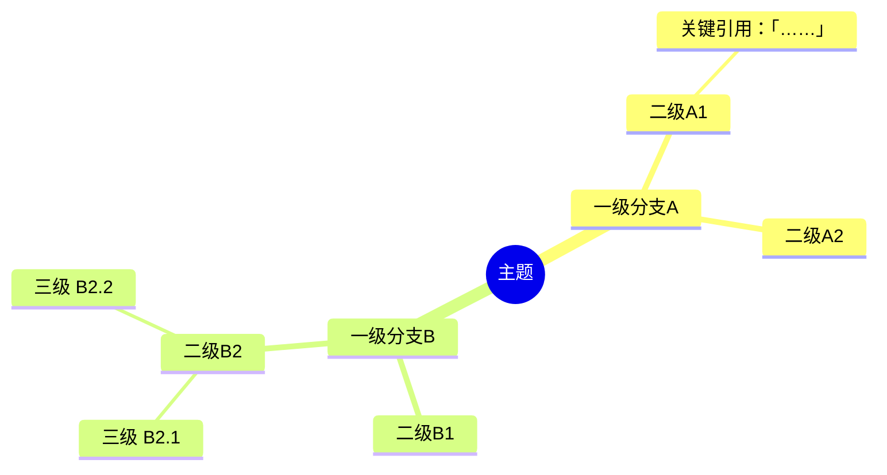
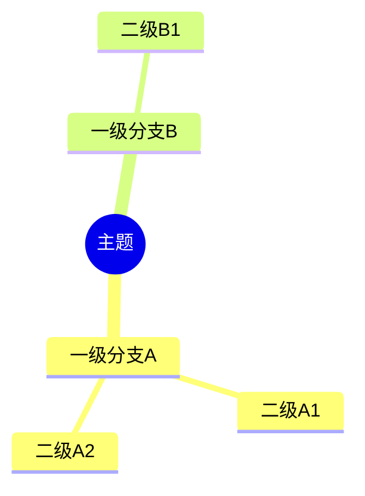

# 场景 3：知识星球精华 → 思维导图

## 一句话定位
知识星球帖子（或一段长文 / 帖子合集）→ NotebookLM Mind Map → 输出 Markdown + Mermaid 思维导图。

## 触发词

- 「知识星球精华做思维导图」「星球帖子做 mind map」
- 「这堆文字整理成思维导图」
- 「这个帖子做成知识结构图」

## 为什么单独做？

知识星球**没有公开 URL 可抓**（要登录 + 反爬严格），所以本场景的"输入路径"和其他场景不同：

| 输入方式 | 说明 |
|---|---|
| **A. 复制粘贴文本** | 推荐 ✅ —— 用户从 App / 网页复制帖子全文给 AI |
| **B. 截图 OCR** | 用户拍/截图，AI 调 OCR 提取（精度有限） |
| **C. 导出工具** | 用户用第三方导出工具（如「星球助手」）导出 md，再喂给 AI |

❌ 不要尝试用爬虫直抓星球，违反 ToS 且账号会被封。

## 输入

| 字段 | 必填 | 说明 |
|---|---|---|
| 帖子文本 | ✅ | 用户粘贴或上传 .md |
| 主题命名 | ⬜ | 默认从首句提取 |
| 输出格式 | ⬜ | `mermaid` / `markdown 大纲` / `两者都要`，默认两者 |

## 输出

- **Markdown 大纲版** —— 给人速读
- **Mermaid mindmap 代码块** —— 渲染为图（可粘贴到飞书 / Notion / Obsidian）
- **结构化 JSON** —— 留给后续二次处理

## 工作流

```
[Step 1] 接收文本
  ├─ 接收用户粘贴的内容
  ├─ 自动检测：单帖 / 多帖合集
  └─ 多帖：自动按 "## " 分隔切片

[Step 2] 上传 NotebookLM
  ├─ 创建 notebook（命名："<星球名>·<主题>"）
  ├─ 把文本作为 source 上传
  └─ 等待索引

  ⚠️ **C 方案（短文本跳过 NotebookLM）**：若文本 &lt; 2000 字且用户未指定要 NotebookLM 输出，可跳过 Step 2-3，直接 LLM 结构化。在 mindmap.md 顶部注明"场景 3 SOP（C 方案，跳过 NotebookLM 直接 LLM 出 mindmap）"。

[Step 3] 调用 NotebookLM Mind Map 工具
  ├─ NotebookLM 内置 Mind Map 生成
  ├─ 提取 JSON 树结构
  └─ 输出：raw_mindmap.json

[Step 4] 转换为多格式
  ├─ JSON → Markdown 大纲（`-` 缩进）
  ├─ JSON → Mermaid mindmap 语法
  └─ 输出：mindmap.md（含两版）

[Step 5] 可选落地
  → 询问用户是否同步到飞书 / IMA
  → 飞书：含 mermaid 渲染的 docx
  → IMA：纯 Markdown 笔记
```

## Mermaid 模板



## Mind Map 生成 Prompt

```
基于已上传的 source，生成一份思维导图。

要求：
1. 根节点 = 主题，不超过 12 字
2. 一级分支 3-7 个，按"是什么 / 为什么 / 怎么做 / 反例 / 启示"等维度组织
3. 二级分支每条带原文关键词，3-15 字
4. 关键节点附原文金句（≤30 字，用「」包裹）
5. 树深度不超过 4 层

输出 JSON 树结构：
{
  "root": "主题",
  "children": [
    {
      "name": "一级分支",
      "quote": "可选金句",
      "children": [
        { "name": "二级", "children": [...] }
      ]
    }
  ]
}
```

## 输出物示例

````
# 星球精华 · <主题>

## 📋 Markdown 大纲

- 主题
  - 一级分支 A
    - 二级 A1
      - 「金句……」
    - 二级 A2
  - 一级分支 B
    - 二级 B1

## 🌳 Mermaid 思维导图



## 📎 原始资料
[折叠]粘贴的原帖[/折叠]
````

## 进阶：星球月度精华

```
我把 5 月在"X 星球"收藏的 20 个帖子复制给你，整理成月度知识结构图
```

AI 内部：
1. 自动分组（按主题聚类）
2. 每组生成子 mindmap
3. 顶层汇总成 "5 月主题地图"
4. 输出一篇飞书文档 + Mermaid 全景图

## 隐私与合规

- 知识星球内容受星主版权保护，**生成的思维导图仅供本人学习**
- 不要把 mindmap 公开转发到外部平台
- 输出物 metadata 中标注 "Source: 知识星球·<星球名>，本人订阅"

## 🛡️ 诚实度契约

> 详见 `references/honesty-rules.md`

### 本场景的诚实度优势

输入是用户**完整粘贴的文本**，无截断、无元数据猜测，AI 可以基于完整内容生成 mindmap。
**这是 5 个场景中诚实度风险最低的一个**。

### 完整度声明

```markdown
> **抓取完整度**: full（用户提供完整文本）
> **AI 演绎程度**: low（仅做结构化重组，未引入新内容）
```

### 标注规则

- mindmap 节点：直接来自原文表述，标 *(原文)*
- 节点描述（如附加判断）：标 *(AI 总结)*
- 「金句」原文中确实出现：用「」包裹
- 「关键引用」：必须是逐字引用，不可改写

### 输出 schema 必带

```json
{
  "source_completeness": "full",
  "ai_inference_ratio": "low",
  "method": "用户粘贴文本 + LLM 结构化",
  "warnings": []
}
```
